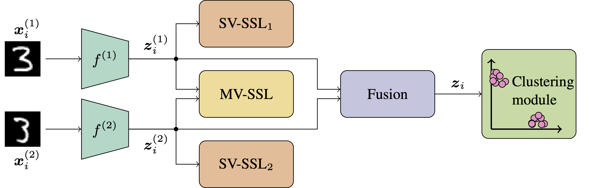
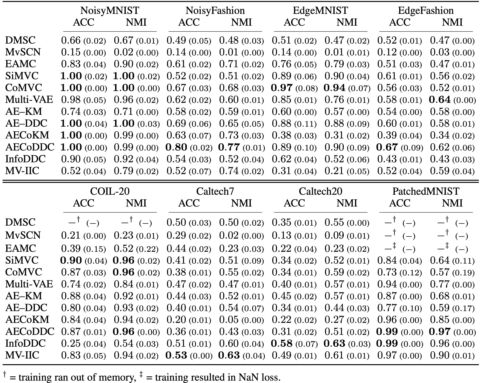

# DeepMVC: A Unified Framework for Deep Multi-view Clustering

This repository contains the code for the paper _"On the Effects of Self-supervision and Contrastive Alignment in Deep Multi-view Clustering"_, CVPR 2023.

_**Abstract** -
Recent works in deep multi-view clustering (MVC) vary significantly in the motivation, implementation and evaluation of new methods.
This makes it difficult to reproduce and compare the performance of models, and to identify directions for future work.
Here we illustrate that many recent methods can be regarded as instances of a new unified framework, referred to as DeepMVC.
This provides novel insight into the field, allowing us to develop new instances of DeepMVC in a principled manner.
We conduct an extensive experimental evaluation of recent methods and our new instances, showing that these outperform previous methods on several datasets.
Finally, we present key findings from our experiments, and suggest promising directions for future research.
To enhance the openness of the field, we provide an open-source implementation of DeepMVC, including the baselines and the new instances.
Our implementation also includes a consistent evaluation protocol, facilitating fair and accurate evaluation of methods._


*Figure 1: Overview of the DeepMVC framework and its components.*

## Evaluation results

*Table 1: Main results from our experimental evaluation.*


## Preparing datasets
This repository contains the Caltech7 and Caltech20 datasets. 
NoisyMNIST, NoisyFashion, EdgeMNIST, EdgeFashion, and PatchedMNIST can be generated without additional downloads by running
```bash
python -m data.make_dataset noisymnist noisyfashionmnist edgemnist edgefashionmnist patchedmnist
```
from the [`src`](src) directory.


### Preparing the COIL-20 dataset
The COIL-20 dataset is generated by first downloading the original images from 
[here](https://www.cs.columbia.edu/CAVE/software/softlib/coil-20.php), 
and placing them in `data/raw/coil20`.
The following command will then generate the training-ready dataset
```bash
python -m data.make_dataset coil20
```

### Paired datasets for pre-training MvSCN
Pre-training the Siamese network for MvSCN requires a version of the dataset where samples are grouped together in positive and negative pairs.
The paired datasets are generated by running
```bash
python -m data.pair_dataset -d <dataset_name>
```
where `<dataset_name>` is one of `noisymnist`, `noisyfashionmnist`, `edgemnist`, `edgefashionmnist`, `patchedmnist`, `caltech7`, `caltech20`, `coil20`.


## Running experiments
Experiments are run with the command
```bash
python train.py -c <experiment_config>
```
where `<experiment_config>` is the name of a config defined in a file in [`src/config/experiments`](src/config/experiments).
See [Creating new experiments](#creating-new-experiments) for further details on the Config objects. 
Directories containing experiments configs are
* Main evaluation: [`src/config/experiments/benchmark`](src/config/experiments/benchmark)
* Ablation studies: [`src/config/experiments/ablation`](src/config/experiments/ablation)
* Increasing number of views (to reproduce Figure 2 in the paper): [`src/config/experiments/increasing_n_views`](src/config/experiments/increasing_n_views)

Note that some new instances have names in this implementation, compared to in the paper:

| Name in paper | Name in implementation | Name in experiment config |
|---------------|------------------------|---------------------------|
| AE-KM         | SAEKM                  | `saekm`                   |
| AE-DDC        | SAE                    | `sae`                     |
| AECoKM        | CAEKM                  | `caekm`                   |
| AECoDDC       | CAE                    | `cae`                     |
| InfoDDC       | MIMVC                  | `mimvc`                   |


### Logging results with Weights and Biases.
`train.py` logs the experiment results to a [Weights and Biases](https://wandb.ai/site) project.
The project name is specified by setting `WANDB_PROJECT="<project_name>"` in [`src/lib/wandb_utils.py`](src/lib/wandb_utils.py) (set to `"mvc-framework"` by default.) 

### Running experiments with Docker
A docker image with all dependencies can be built by running
```bash
docker build \
  --tag <image_tag> \
  --rm \
  --no-cache \
  --pull \
  -f docker/Dockerfile \
  .
```
from the root directory of the repository.

### Overriding config parameters at the command line
Most config parameters can be overridden by specifying them at the command line. For instance, to run CoMVC on NoisyMNIST with batch size 256 instead of 100, run
```bash
python train.py -c noisymnist_comvc --batch_size 256
```
Note that the config hierarchy (described below) is "traversed" on the command line using `/`, so running CoMVC on NoisyMNIST without the adaptive weight on the contrastive loss is done with
```bash
python train.py -c noisymnist --model_config/loss_config/contrast_adaptive_weight False
```
and with learning rate `1e-4`
```bash
python train.py -c noisymnist --model_config/optimizer_config/learning_rate 0.0001
```

## Creating new experiments
### The [`Config`](src/config/config.py) class
All experiments run with [`src/train.py`](src/train.py) are instances of [`Experiment`](src/config/templates/experiment.py), a subclass of the generic [`Config`](src/config/config.py) class. 
Configs are implemented as hierarchical dataclass-like objects (based on [pydantic's](https://pydantic-docs.helpmanual.io/) `BaseModel`), where [`Experiment`](src/config/templates/experiment.py) is the top-level class.

For instance, instances of [`Experiment`](src/config/templates/experiment.py) are required to specify the `dataset_config` attribute as an instance of [`Dataset`](src/config/templates/dataset.py), containing the name and parameters of the dataset to use for the experiment. 

All [`Config`](src/config/config.py) subclasses used in the experiments are defined in [`src/config/templates`](src/config/templates).
This directory includes [`Config`](src/config/config.py) subclasses for datasets, models, encoders, fusion, clustering modules, etc.

### Defining a custom experiment

Defining a custom CoMVC experiment on NoisyMNIST from scratch is done with
```python
from config.templates.experiment import Experiment
from config.templates.dataset import Dataset
from config.templates.models.simvc_comvc import CoMVC, CoMVCLoss
from config.templates.encoder import Encoder
from config.templates.optimizer import Optimizer

noisymnist_comvc_custom = Experiment(
    dataset_config=Dataset(
        name="noisymnist",
        n_train_samples=20000, # Reduce the number of samples to train quicker.
    ),
    model_config=CoMVC(
        # Ene encoder per view
        encoder_configs=[
            Encoder(layers="cnn_small", input_size=[1, 28, 28]), 
            Encoder(layers="cnn_small", input_size=[1, 28, 28]), 
        ],
        loss_config=CoMVCLoss(
            tau=0.07    # Change the softmax temperature in the contrastive loss.
        ),
        optimizer_config=Optimizer(
            learning_rate=1e-4  # Change the learning rate
        ),
    ),
    n_clusters=10,  # The number of clusters is specified in the Experiment config
    batch_size=256, # so is the batch size
    n_epochs=200,   # and the number of training epochs
)
```
This file should be imported in [`src/config/experiments/__init__.py`](src/config/experiments/__init__.py).
The custom experiment can then be run with
```bash
python train.py -c noisymnist_comvc_custom
```
